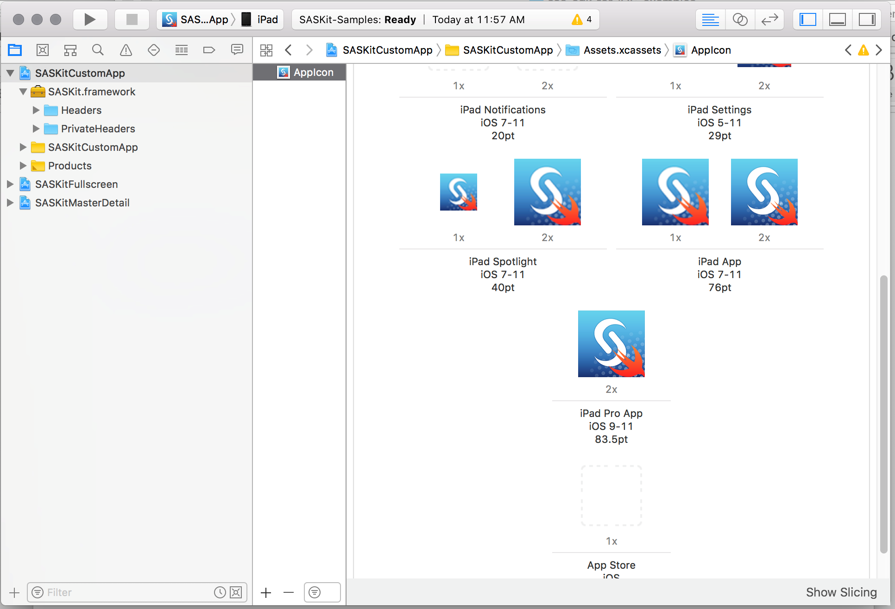
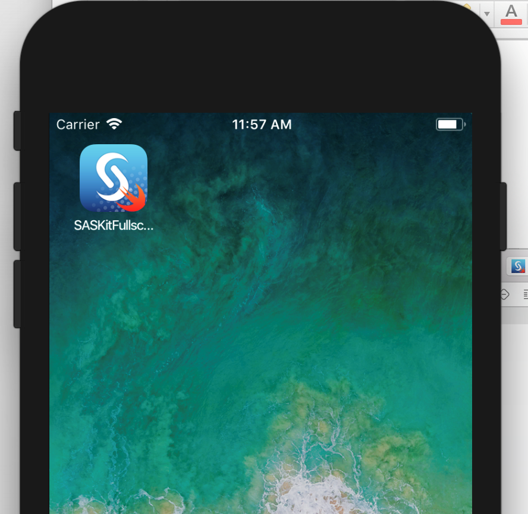

# Getting Started: Personalize the [SAS Mobile BI App](https://itunes.apple.com/us/app/sas-mobile-bi/id511030524?mt=8)

The first step many users want to take is to personalize the existing SAS Mobile BI app by building a mobile app that uses their app name and icon.

## Simply add your icon to the Xcode project:

  
*Icons in Xcode project*

## After building your personalized app, the icon you added will be displayed.

  
*Your custom mobile app deployed with your icon* 
